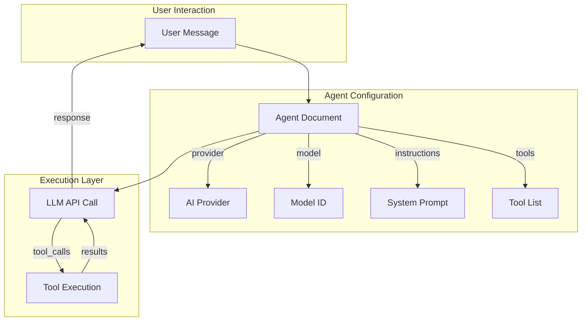
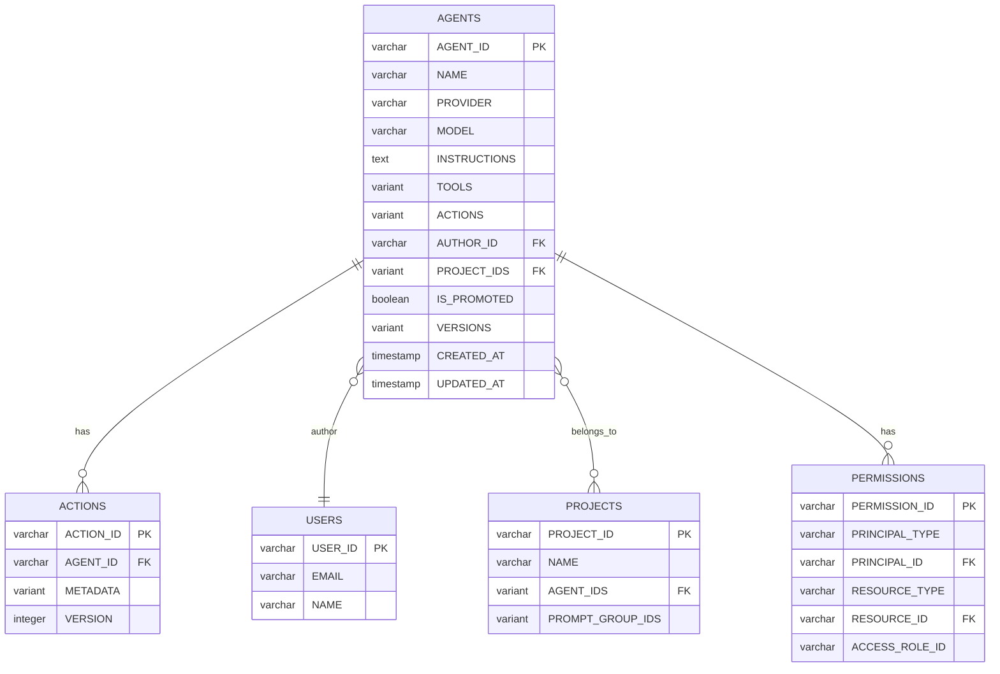
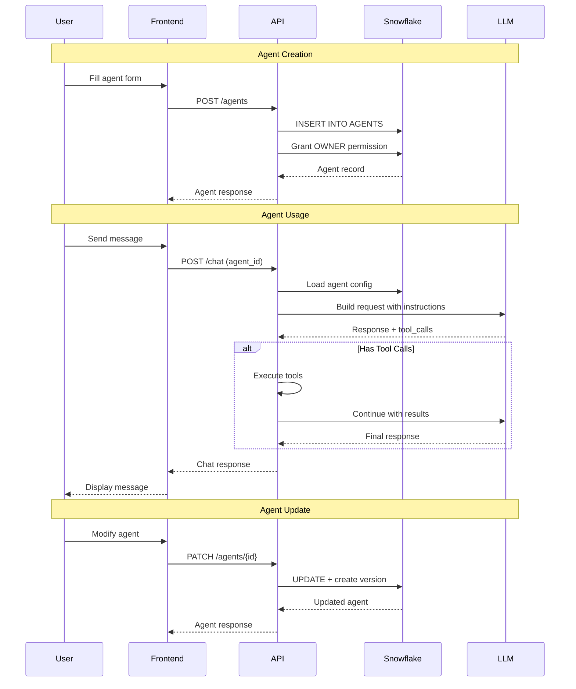
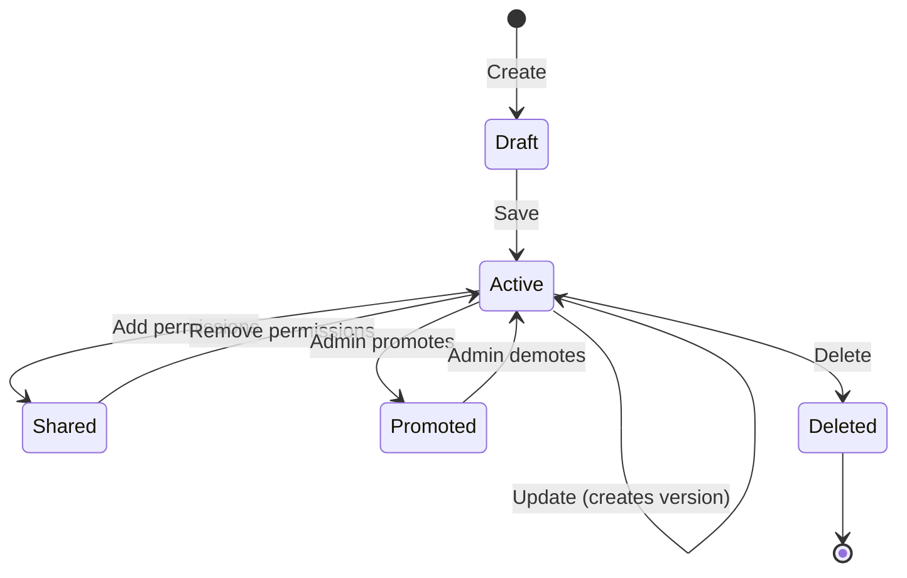
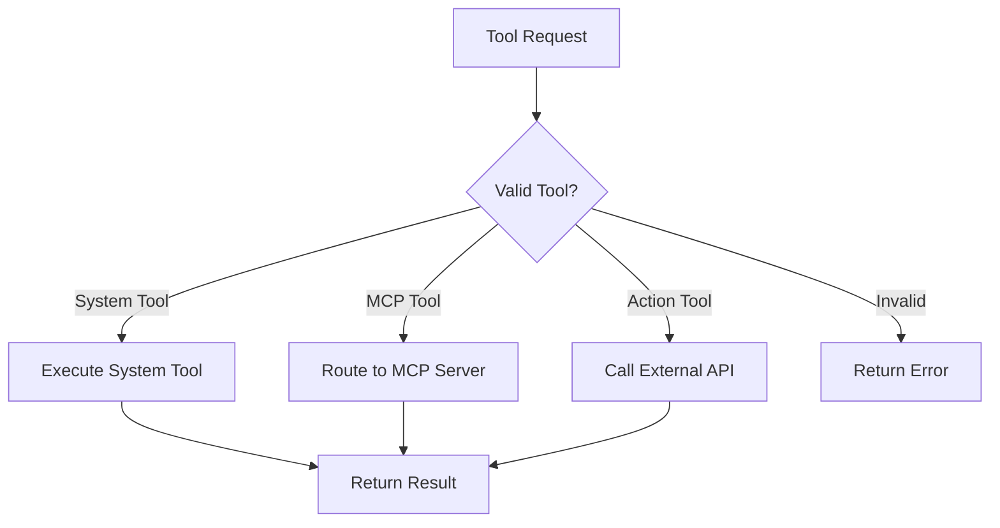
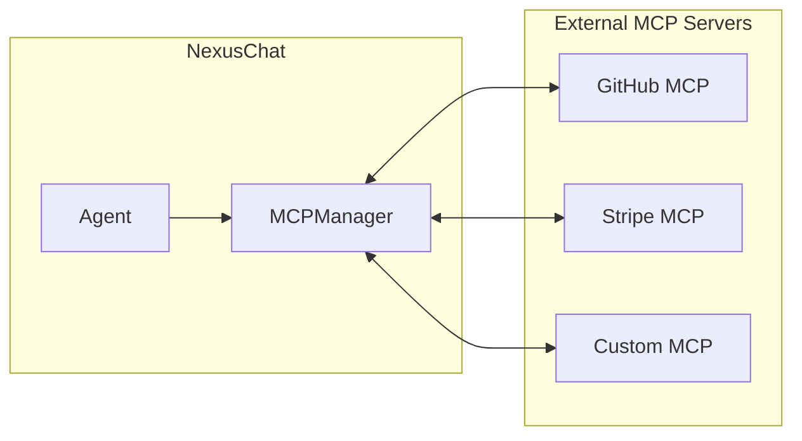
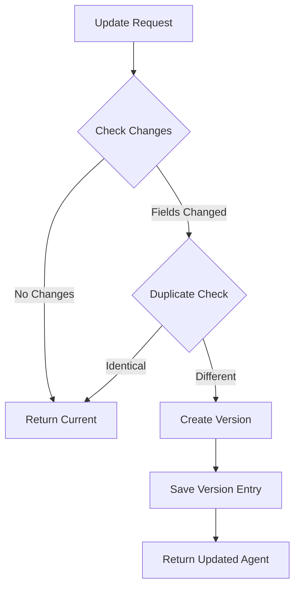
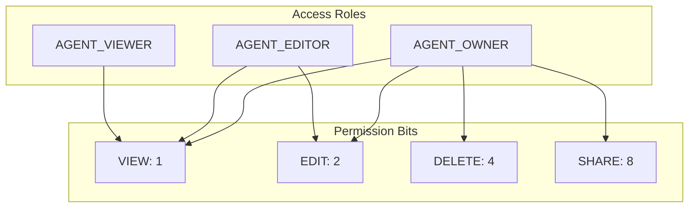
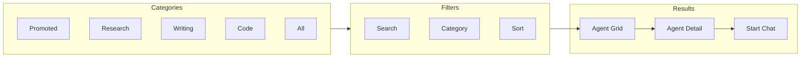
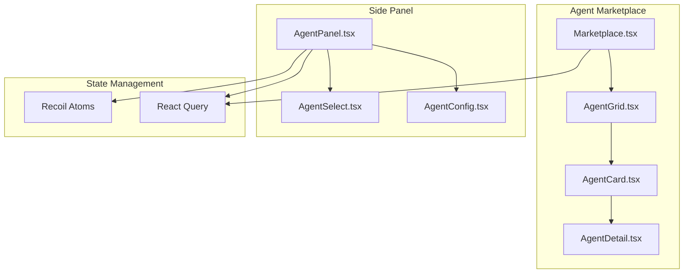

# NexusChat Agent Architecture

> Comprehensive documentation of the Agent system architecture, storage, APIs, and usage patterns.

## Table of Contents

1. [Overview](#1-overview)
2. [Agent Data Model](#2-agent-data-model)
3. [Storage Architecture](#3-storage-architecture)
4. [API Endpoints](#4-api-endpoints)
5. [Agent Lifecycle](#5-agent-lifecycle)
6. [Tools & Capabilities](#6-tools--capabilities)
7. [MCP Integration](#7-mcp-integration)
8. [Custom Actions](#8-custom-actions)
9. [Versioning System](#9-versioning-system)
10. [Permissions & Sharing](#10-permissions--sharing)
11. [Agent Marketplace](#11-agent-marketplace)
12. [Frontend Components](#12-frontend-components)
13. [Usage Examples](#13-usage-examples)

---

## 1. Overview

Agents in NexusChat are **configuration documents** stored in Snowflake that define AI assistant behaviors. They are NOT executable code files - instead, they specify:

- Which AI model to use (provider + model)
- System instructions (personality, rules, capabilities)
- Available tools (web search, code execution, file search)
- Custom API integrations (actions)
- Access permissions and sharing settings



### Key Concepts

| Concept | Description |
|---------|-------------|
| **Agent** | Configuration document defining AI behavior |
| **Ephemeral Agent** | Temporary, in-memory agent for quick interactions |
| **Tools** | Built-in capabilities (web_search, execute_code, file_search) |
| **Actions** | Custom API integrations via OpenAPI specs |
| **MCP Servers** | External tool providers via Model Context Protocol |
| **Versions** | Historical snapshots of agent configurations |

---

## 2. Agent Data Model

### Schema Definition

**Location:** `packages/data-schemas/src/schema/agent.ts`

```typescript
interface IAgent {
  // Identity
  id: string;                    // Unique ID: "agent_{nanoid}"
  name?: string;                 // Display name
  description?: string;          // Short description
  avatar?: {                     // Profile image
    filepath: string;
    source: string;
  };

  // AI Configuration
  provider: string;              // "openai", "anthropic", "google", etc.
  model: string;                 // "gpt-4-turbo", "claude-3-opus", etc.
  instructions?: string;         // System prompt
  model_parameters?: {           // LLM parameters
    temperature?: number;
    max_tokens?: number;
    top_p?: number;
    frequency_penalty?: number;
    presence_penalty?: number;
  };

  // Capabilities
  tools?: string[];              // Enabled tools
  actions?: string[];            // Custom API actions
  agent_ids?: string[];          // Sub-agents for chaining
  artifacts?: string;            // Artifact rendering mode

  // Behavior
  recursion_limit?: number;      // Max nested agent calls
  end_after_tools?: boolean;     // Stop after tool execution
  hide_sequential_outputs?: boolean; // Hide intermediate results
  conversation_starters?: string[]; // Suggested prompts

  // Resources
  tool_resources?: {             // Files for tools
    file_search?: { file_ids: string[] };
    execute_code?: { file_ids: string[] };
  };

  // Ownership & Access
  author: ObjectId;              // Creator's user ID
  authorName?: string;           // Creator's display name
  projectIds?: ObjectId[];       // Associated projects
  isCollaborative?: boolean;     // @deprecated - use ACL

  // Marketplace
  category: string;              // Agent category
  is_promoted?: boolean;         // Featured flag
  support_contact?: {
    name?: string;
    email?: string;
  };

  // Version History
  versions?: IAgentVersion[];    // Historical snapshots

  // Timestamps
  createdAt: Date;
  updatedAt: Date;
}
```

---

## 3. Storage Architecture

### Snowflake Database Structure

NexusChat uses **Snowflake** as the single source of truth for all data. Each organization has its own database with the NEXUSCHAT schema containing agent-related tables.



### Per-Organization Database Structure

```
HCS0001_DB/
├── NEXUSCHAT/                  ← Agent & Chat Data
│   ├── AGENTS
│   ├── AGENT_VERSIONS
│   ├── AGENT_ACTIONS
│   ├── AGENT_PERMISSIONS
│   ├── CONVERSATIONS
│   ├── CHAT_MESSAGES
│   └── USER_PREFERENCES
├── CLAIMS/                     ← Healthcare Claims
│   └── INSURANCE_CLAIMS
├── PATIENTS/
│   └── PATIENT_RECORDS
└── CORTEX_DATA/               ← AI/ML Features
    └── EMBEDDINGS
```

### Global vs User Agents

| Storage Type | Location | Access |
|--------------|----------|--------|
| **User Agents** | `NEXUSCHAT.AGENTS` with `AUTHOR_ID` field | Owner and shared users |
| **Global Agents** | `NEXUSCHAT.PROJECTS.AGENT_IDS` where name="instance" | All authenticated users |
| **Promoted Agents** | `NEXUSCHAT.AGENTS` with `IS_PROMOTED=TRUE` | Featured in marketplace |

### Benefits of Snowflake Storage

- **Single Source of Truth** - All data in one system
- **HIPAA Compliance** - Single audit surface
- **SQL Joins** - Query agents alongside healthcare claims
- **Time Travel** - Built-in versioning and recovery
- **Lower Costs** - No separate database hosting

### File Storage

Agent-related files are stored based on configuration:

- **Local Storage:** `./uploads/agents/{agent_id}/`
- **S3 Storage:** `{bucket}/agents/{agent_id}/`

File types:
- Avatars: `avatar.{jpg|png|webp}`
- Tool resources: `{file_id}.{ext}`

---

## 4. API Endpoints

### Base Route: `/api/agents`

All endpoints require JWT authentication.

### CRUD Operations

```http
# Create Agent
POST /api/agents
Content-Type: application/json
Authorization: Bearer {token}

{
  "name": "Research Assistant",
  "provider": "openai",
  "model": "gpt-4-turbo",
  "description": "Helps with research tasks",
  "instructions": "You are a research assistant...",
  "tools": ["web_search", "file_search"],
  "category": "research"
}

Response: 201 Created
{
  "id": "agent_abc123",
  "name": "Research Assistant",
  ...
}
```

```http
# List Agents (with pagination)
GET /api/agents?limit=20&cursor={base64}&category=research&search=query

Response: 200 OK
{
  "object": "list",
  "data": [...],
  "has_more": true,
  "first_id": "agent_xxx",
  "last_id": "agent_yyy",
  "after": "base64_cursor"
}
```

```http
# Get Agent (basic view)
GET /api/agents/{id}

# Get Agent (full config - requires EDIT permission)
GET /api/agents/{id}/expanded
```

```http
# Update Agent
PATCH /api/agents/{id}
{
  "instructions": "Updated instructions..."
}
```

```http
# Delete Agent
DELETE /api/agents/{id}
```

### Special Operations

```http
# Duplicate Agent
POST /api/agents/{id}/duplicate

Response: 201 Created
{
  "agent": {...},
  "actions": [...]
}
```

```http
# Revert to Previous Version
POST /api/agents/{id}/revert
{
  "version_index": 2
}
```

```http
# Upload Avatar
POST /api/agents/{id}/avatar
Content-Type: multipart/form-data

file: [binary]
```

```http
# Get Categories
GET /api/agents/categories

Response: 200 OK
[
  { "value": "promoted", "label": "Promoted", "count": 5 },
  { "value": "research", "label": "Research", "count": 12 },
  { "value": "all", "label": "All", "count": 50 }
]
```

---

## 5. Agent Lifecycle



### State Transitions



---

## 6. Tools & Capabilities

### Built-in System Tools

| Tool | Description | Required Resources |
|------|-------------|-------------------|
| `web_search` | Search the internet | None |
| `execute_code` | Run code in sandbox | Optional: code files |
| `file_search` | Search vector stores | Required: file_ids |

### Tool Configuration

```javascript
// Agent tools array
{
  "tools": [
    "web_search",
    "execute_code",
    "file_search"
  ],
  "tool_resources": {
    "file_search": {
      "file_ids": ["file_abc", "file_def"]
    },
    "execute_code": {
      "file_ids": ["file_xyz"]
    }
  }
}
```

### Tool Resolution Flow



---

## 7. MCP Integration

### Model Context Protocol

MCP (Model Context Protocol) allows external servers to provide tools to agents.



### MCP Tool Naming

```javascript
// MCP tool format
`${toolName}${mcp_delimiter}${serverName}`

// Examples
"create_issue::github"
"create_customer::stripe"
"mcp__all::filesystem"  // All tools from server
```

### Ephemeral Agent with MCP

```javascript
// Request body for ephemeral agent
{
  "ephemeralAgent": {
    "mcp": ["github", "stripe"],  // MCP servers
    "web_search": true,
    "execute_code": false,
    "file_search": false
  }
}
```

---

## 8. Custom Actions

### Action Structure

Actions are custom API integrations defined via OpenAPI specifications.

```typescript
interface Action {
  action_id: string;      // Unique ID
  agent_id: string;       // Parent agent
  type?: string;          // Action type
  metadata: {
    domain: string;       // e.g., "stripe", "shopify"
    api_key?: string;     // Encrypted
    auth?: ActionAuth;
    raw_spec?: string;    // OpenAPI spec
    privacy_policy_url?: string;
    oauth_client_id?: string;     // Encrypted
    oauth_client_secret?: string; // Encrypted
  };
  version: number;
}
```

### Action Endpoints

```http
# List Actions
GET /api/agents/actions

# Add Action to Agent
POST /api/agents/actions/{agent_id}
{
  "domain": "stripe",
  "api_key": "sk_xxx",
  "raw_spec": "openapi: 3.0..."
}

# Remove Action
DELETE /api/agents/actions/{agent_id}/{action_id}
```

### Action Tool References

```javascript
// In agent.tools array
"create_customer_stripe_action123"
// Format: {operation}_{domain}_{actionId}
```

---

## 9. Versioning System

### Version Creation

Versions are automatically created when significant changes occur:



### Version Entry Structure

```javascript
{
  // All agent fields at this point in time
  name: "Agent Name",
  instructions: "...",
  tools: [...],
  // ...

  // Version metadata
  createdAt: "2024-01-15T10:00:00Z",
  updatedAt: "2024-01-15T10:00:00Z",
  updatedBy: "user_123",        // Who made the change
  actionsHash: "sha256..."      // Hash of action metadata
}
```

### Version Operations

```javascript
// Get version count
agent.version = agent.versions.length;

// Revert to version
POST /agents/{id}/revert
{ "version_index": 2 }

// Version comparison uses isDuplicateVersion()
// Excludes: _id, id, createdAt, updatedAt, author, __v, versions, actionsHash
```

### Actions Hash

For action-heavy agents, a SHA-256 hash of action metadata prevents unnecessary versions:

```javascript
// Hash generation
const metadataString = sortedActionIds
  .map(id => `${id}:{metadata_json}`)
  .join(';');
const hash = sha256(metadataString);
```

---

## 10. Permissions & Sharing

### Access Control List (ACL)



### Permission Entry

```javascript
{
  principalType: "user",          // "user" | "project" | "global"
  principalId: ObjectId("..."),   // User/Project ID
  resourceType: "agent",
  resourceId: ObjectId("..."),    // Agent._id
  accessRoleId: "agent-owner",    // Role string
  grantedBy: ObjectId("..."),     // Who granted
  createdAt: Date
}
```

### Permission Middleware

```javascript
// Route protection
router.get('/:id',
  canAccessAgentResource({
    requiredPermission: PermissionBits.VIEW,
    resourceIdParam: 'id'
  }),
  v1.getAgent
);
```

### Sharing an Agent

```javascript
// Grant viewer access
POST /api/permissions
{
  "principalType": "user",
  "principalId": "user_456",
  "resourceType": "agent",
  "resourceId": "agent_abc123",
  "accessRoleId": "agent-viewer"
}
```

---

## 11. Agent Marketplace

### Discovery Flow



### Category System

```typescript
interface AgentCategory {
  value: string;        // "research"
  label: string;        // "Research"
  description?: string;
  order: number;        // Sort order
  isActive: boolean;    // Show/hide
  custom?: boolean;     // User-created
}
```

### Marketplace Query

```http
GET /api/agents?category=research&search=data&promoted=1&limit=20&cursor=xxx
```

### Promoted Agents

- Set by admin via `is_promoted: true`
- Appear in "Promoted" category tab
- Higher visibility in marketplace

---

## 12. Frontend Components

### Component Hierarchy



### Key Components

| Component | Location | Purpose |
|-----------|----------|---------|
| `Marketplace.tsx` | `client/src/components/Agents/` | Browse agents |
| `AgentCard.tsx` | `client/src/components/Agents/` | Agent preview card |
| `AgentDetail.tsx` | `client/src/components/Agents/` | Full agent info modal |
| `AgentPanel.tsx` | `client/src/components/SidePanel/Agents/` | Create/edit form |
| `AgentConfig.tsx` | `client/src/components/SidePanel/Agents/` | Configuration fields |
| `AgentSelect.tsx` | `client/src/components/SidePanel/Agents/` | Agent dropdown |

### React Query Hooks

```typescript
// List agents
useGetAgentsQuery({ category, search, limit });

// Get single agent
useGetAgentByIdQuery(agentId);

// Mutations
useCreateAgentMutation();
useUpdateAgentMutation();
useDeleteAgentMutation();
useDuplicateAgentMutation();
```

### Recoil State

```typescript
// Ephemeral agent per conversation
const ephemeralAgentByConvoId = atomFamily<TEphemeralAgent, string>({
  key: 'ephemeralAgentByConvoId',
  default: null
});
```

---

## 13. Usage Examples

### Creating a Research Agent

```javascript
// POST /api/agents
{
  "name": "Research Pro",
  "provider": "anthropic",
  "model": "claude-3-opus",
  "description": "Advanced research assistant with web search",
  "instructions": `You are a research assistant specialized in finding and synthesizing information.

Guidelines:
- Always cite sources
- Verify information from multiple sources
- Present balanced perspectives
- Use clear, academic language`,
  "tools": ["web_search"],
  "category": "research",
  "conversation_starters": [
    "Research the latest developments in AI",
    "Find peer-reviewed sources on climate change",
    "Summarize recent news about renewable energy"
  ],
  "support_contact": {
    "name": "Research Team",
    "email": "research@example.com"
  }
}
```

### Creating a Code Assistant

```javascript
// POST /api/agents
{
  "name": "Code Helper",
  "provider": "openai",
  "model": "gpt-4-turbo",
  "description": "Helps write and debug code",
  "instructions": `You are an expert programmer assistant.

Capabilities:
- Write clean, efficient code
- Debug issues
- Explain concepts
- Review code for best practices

Always:
- Include comments
- Handle errors gracefully
- Follow language conventions`,
  "tools": ["execute_code"],
  "model_parameters": {
    "temperature": 0.2,
    "max_tokens": 4096
  },
  "artifacts": "gpt4_turbo",
  "category": "code"
}
```

### Agent with MCP Integration

```javascript
// POST /api/agents
{
  "name": "GitHub Assistant",
  "provider": "openai",
  "model": "gpt-4-turbo",
  "description": "Manages GitHub repositories",
  "instructions": "Help users manage their GitHub repositories, issues, and PRs.",
  "tools": [
    "mcp__all::github",  // All GitHub MCP tools
    "web_search"
  ],
  "category": "productivity"
}
```

### Agent with Custom Actions

```javascript
// Step 1: Create agent
POST /api/agents
{
  "name": "Stripe Helper",
  "provider": "openai",
  "model": "gpt-4-turbo",
  "description": "Manages Stripe payments",
  "instructions": "Help users with Stripe payment operations."
}

// Step 2: Add action
POST /api/agents/actions/{agent_id}
{
  "domain": "stripe",
  "api_key": "sk_live_xxx",
  "raw_spec": "openapi: 3.0.0\ninfo:\n  title: Stripe API..."
}
```

### Using Ephemeral Agent

```javascript
// In chat request body
{
  "conversationId": "conv_123",
  "message": "Search for AI news",
  "ephemeralAgent": {
    "web_search": true,
    "execute_code": false,
    "file_search": false,
    "mcp": []
  }
}
```

### Reverting Agent Version

```javascript
// Get agent to see version count
GET /api/agents/{id}/expanded
// Response includes: version: 5

// Revert to version 2
POST /api/agents/{id}/revert
{
  "version_index": 2
}
// Agent now reflects state from version 2
// New version 6 is created with reverted state
```

---

## File Reference

| Category | File Path |
|----------|-----------|
| Schema | `packages/data-schemas/src/schema/agent.ts` |
| Types (Server) | `packages/data-schemas/src/types/agent.ts` |
| Types (Client) | `packages/data-provider/src/types/assistants.ts` |
| CRUD Model | `api/models/Agent.js` |
| Controller | `api/server/controllers/agents/v1.js` |
| Routes | `api/server/routes/agents/v1.js` |
| Actions | `api/server/routes/agents/actions.js` |
| Tools | `api/server/routes/agents/tools.js` |
| MCP | `api/server/controllers/mcp.js` |
| Marketplace UI | `client/src/components/Agents/Marketplace.tsx` |
| Agent Panel | `client/src/components/SidePanel/Agents/AgentPanel.tsx` |
| Permissions | `config/migrate-agent-permissions.js` |
