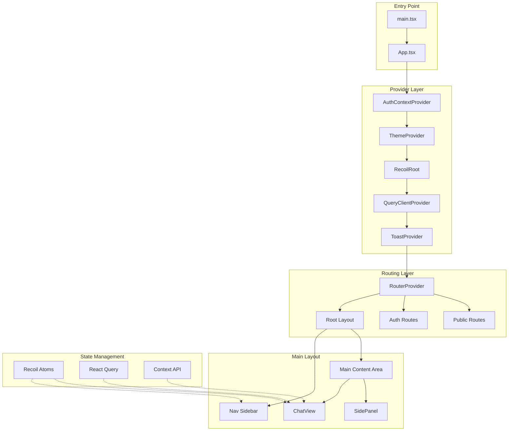
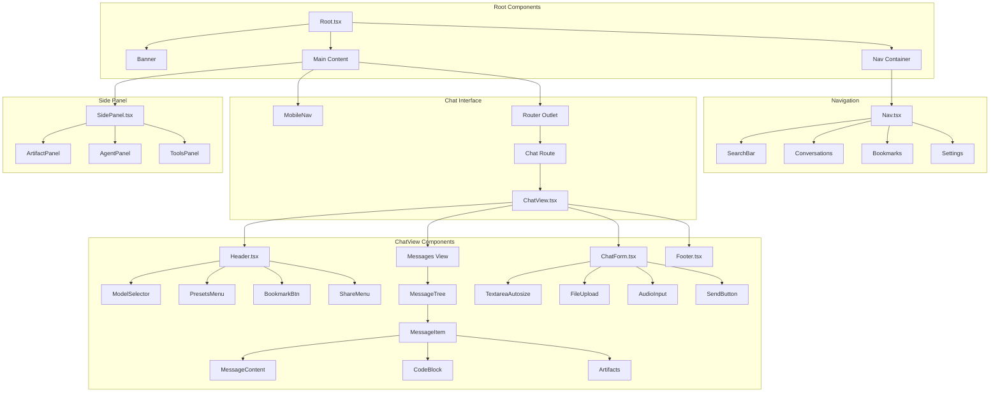
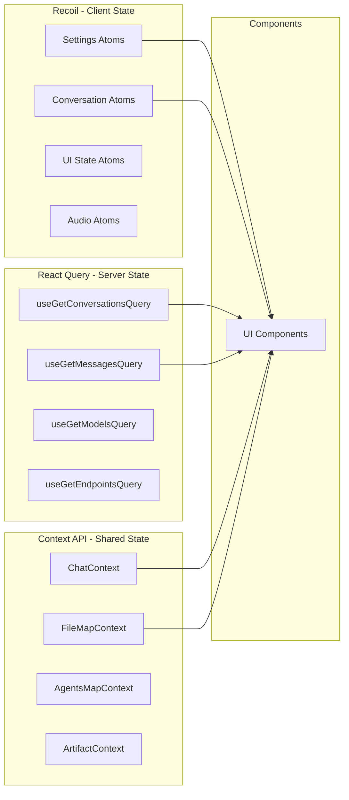
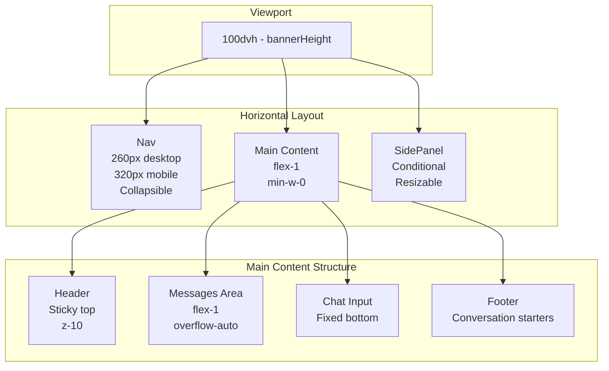
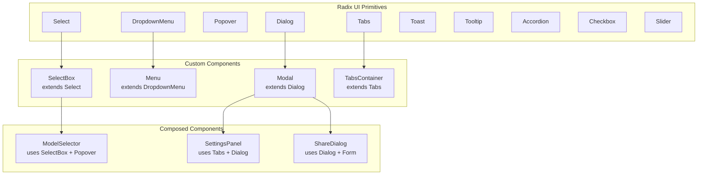
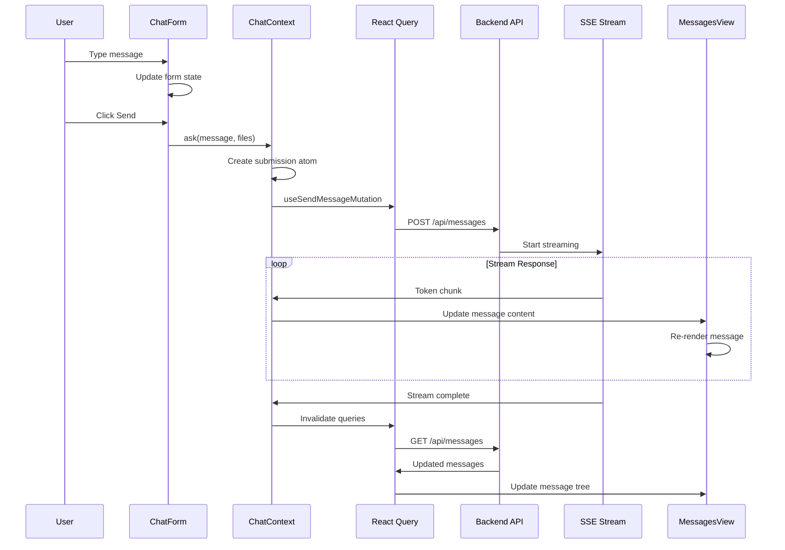
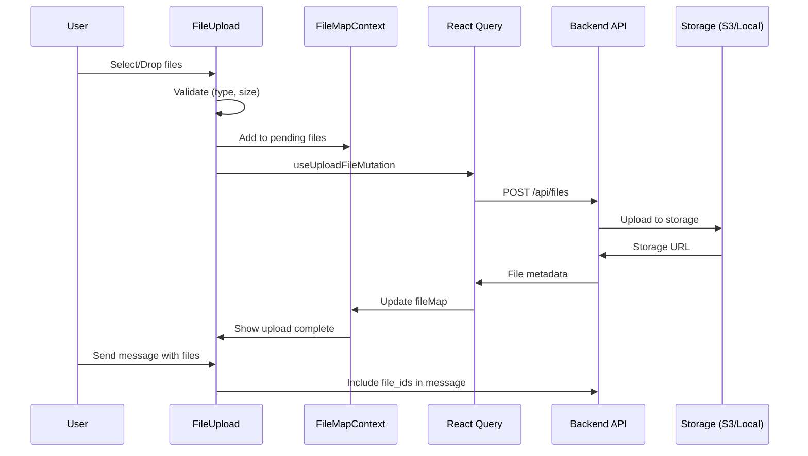

# NexusChat UI Architecture

## Executive Summary

NexusChat's frontend is built on **LibreChat**, a sophisticated React-based chat application. The architecture follows modern React patterns with a hybrid state management approach, component composition, and extensive customization capabilities.

**Key Characteristics:**
- **Framework**: React 18.2 with TypeScript
- **State Management**: Recoil (client) + React Query (server) + Context API
- **Styling**: Tailwind CSS with CSS Variables for theming
- **Components**: Radix UI primitives (unstyled, accessible)
- **Build Tool**: Vite 6.3
- **Routing**: React Router DOM v6

---

## Architecture Overview



---

## Component Hierarchy



---

## State Management Architecture



### Recoil Atoms (Client State)

| Atom Category | Purpose | Persistence |
|---------------|---------|-------------|
| `settings/*` | User preferences (theme, fontSize, etc.) | localStorage |
| `conversation/*` | Active conversation state | Memory |
| `submission/*` | Message submission state | Memory |
| `audio/*` | TTS/STT settings | localStorage |
| `search/*` | Search query and results | Memory |

### React Query (Server State)

| Query/Mutation | Endpoint | Purpose |
|----------------|----------|---------|
| `useGetConversationsQuery` | `/api/convos` | Fetch conversation list |
| `useGetMessagesQuery` | `/api/messages/:id` | Fetch messages |
| `useCreateConvoMutation` | `/api/convos` | Create conversation |
| `useSendMessageMutation` | `/api/messages` | Send message |
| `useGetModelsQuery` | `/api/models` | Fetch available models |

### Context Providers

| Context | Purpose | Key Values |
|---------|---------|------------|
| `ChatContext` | Chat operations | `ask()`, `regenerate()`, `stopGenerating()` |
| `FileMapContext` | File metadata | `fileMap`, `setFileMap` |
| `AgentsMapContext` | Agent data | `agentsMap`, `setAgentsMap` |
| `ArtifactContext` | Artifact state | `currentArtifact`, `setArtifact` |
| `MessagesViewContext` | Message tree | `messageTree`, `scrollToMessage()` |

---

## Layout System



### Responsive Breakpoints

| Breakpoint | Nav Width | Behavior |
|------------|-----------|----------|
| Desktop (>768px) | 260px | Always visible, collapsible |
| Mobile (≤768px) | 320px | Overlay, hidden by default |

### CSS Variables for Layout

```css
:root {
  --nav-width: 260px;
  --nav-width-mobile: 320px;
  --header-height: 56px;
  --input-height: auto;
  --side-panel-width: 400px;
}
```

---

## Component Library (Radix UI)



### Key Radix Components Used

| Component | Usage | Customization |
|-----------|-------|---------------|
| `Dialog` | Modals, settings panels | Fully styled with Tailwind |
| `DropdownMenu` | Context menus, action menus | Custom animations |
| `Popover` | Tooltips, hover cards | Positioned relative to trigger |
| `Select` | Model selector, endpoint picker | Custom option rendering |
| `Tabs` | Settings tabs, panel navigation | Underline indicator style |
| `Toast` | Notifications | Custom toast variants |
| `Accordion` | Collapsible sections | Smooth animations |

---

## Theming System

```mermaid
graph TD
    subgraph "Theme Sources"
        ENV[Environment Variables<br/>REACT_APP_THEME_*]
        CSS[CSS Variables<br/>:root / html.dark]
        TW[Tailwind Config<br/>tailwind.config.cjs]
    end

    subgraph "Theme Provider"
        TP[ThemeProvider<br/>@librechat/client]
        TP --> LIGHT[Light Mode]
        TP --> DARK[Dark Mode]
        TP --> SYSTEM[System Preference]
    end

    ENV --> CSS
    CSS --> TW
    TW --> TP

    subgraph "Components"
        COMP[UI Components]
        COMP --> |class="text-primary"| TW
        COMP --> |class="bg-surface-primary"| TW
    end

    TP --> COMP
```

### CSS Variable System

```css
/* Light Mode (default) */
:root {
  --text-primary: theme('colors.gray.800');
  --text-secondary: theme('colors.gray.600');
  --text-tertiary: theme('colors.gray.500');
  --surface-primary: theme('colors.white');
  --surface-secondary: theme('colors.gray.100');
  --surface-tertiary: theme('colors.gray.200');
  --surface-submit: theme('colors.green.700');
  --border-light: theme('colors.gray.100');
  --border-medium: theme('colors.gray.300');
  --brand-purple: #ab68ff;
}

/* Dark Mode */
html.dark {
  --text-primary: theme('colors.gray.200');
  --text-secondary: theme('colors.gray.400');
  --surface-primary: theme('colors.gray.800');
  --surface-secondary: theme('colors.gray.700');
  --surface-submit: theme('colors.green.600');
  --border-light: theme('colors.gray.700');
}
```

### Environment-Based Theme Override

| Variable | Purpose | Example |
|----------|---------|---------|
| `REACT_APP_THEME_TEXT_PRIMARY` | Primary text color | `#1a202c` |
| `REACT_APP_THEME_SURFACE_PRIMARY` | Primary background | `#ffffff` |
| `REACT_APP_THEME_SURFACE_SUBMIT` | Submit button color | `#38a169` |
| `REACT_APP_THEME_BORDER_MEDIUM` | Border color | `#e2e8f0` |

---

## Routing Architecture

```mermaid
graph TD
    subgraph "Public Routes"
        P1[/login]
        P2[/register]
        P3[/forgot-password]
        P4[/reset-password]
        P5[/share/:shareId]
        P6[/oauth/success]
        P7[/oauth/error]
    end

    subgraph "Protected Routes - Root Layout"
        R1[/] --> R2[/c/new]
        R1 --> R3[/c/:conversationId]
        R1 --> R4[/search]
        R1 --> R5[/agents]
        R1 --> R6[/agents/:category]
    end

    subgraph "Auth Guard"
        AG[AuthContextProvider]
        AG --> |authenticated| R1
        AG --> |unauthenticated| P1
    end

    subgraph "Dashboard Routes"
        D1[/dashboard/*]
    end
```

### Route Configuration

```typescript
// Simplified route structure
const routes = [
  { path: '/login', element: <Login /> },
  { path: '/register', element: <Register /> },
  { path: '/share/:shareId', element: <SharedView /> },
  {
    path: '/',
    element: <Root />,  // Protected
    children: [
      { path: 'c/new', element: <ChatRoute /> },
      { path: 'c/:conversationId', element: <ChatRoute /> },
      { path: 'search', element: <Search /> },
      { path: 'agents', element: <AgentMarketplace /> },
    ]
  }
];
```

---

## Message Flow Sequence



---

## File Upload Sequence



---

## Customization & Extension Points

### 1. Adding New Providers

```typescript
// src/Providers/CustomProvider.tsx
import { createContext, useContext, ReactNode } from 'react';

interface CustomContextValue {
  customValue: string;
  setCustomValue: (value: string) => void;
}

const CustomContext = createContext<CustomContextValue | undefined>(undefined);

export const CustomProvider = ({ children }: { children: ReactNode }) => {
  const [customValue, setCustomValue] = useState('');
  return (
    <CustomContext.Provider value={{ customValue, setCustomValue }}>
      {children}
    </CustomContext.Provider>
  );
};

export const useCustomContext = () => {
  const context = useContext(CustomContext);
  if (!context) throw new Error('useCustomContext must be used within CustomProvider');
  return context;
};
```

### 2. Adding New Recoil Atoms

```typescript
// src/store/custom.ts
import { atom, atomFamily, selector } from 'recoil';

export const customSettingAtom = atom<string>({
  key: 'customSetting',
  default: 'default-value',
  effects: [atomWithLocalStorage('customSetting')], // Persist to localStorage
});

export const customDataFamily = atomFamily<CustomData, string>({
  key: 'customDataFamily',
  default: (id) => ({ id, value: null }),
});

export const customSelector = selector({
  key: 'customSelector',
  get: ({ get }) => {
    const setting = get(customSettingAtom);
    return transformSetting(setting);
  },
});
```

### 3. Adding New React Query Hooks

```typescript
// src/data-provider/custom.ts
import { useQuery, useMutation, useQueryClient } from '@tanstack/react-query';

export const useGetCustomDataQuery = (id: string) => {
  return useQuery({
    queryKey: ['customData', id],
    queryFn: () => api.get(`/api/custom/${id}`),
    staleTime: 5 * 60 * 1000, // 5 minutes
  });
};

export const useUpdateCustomDataMutation = () => {
  const queryClient = useQueryClient();
  return useMutation({
    mutationFn: (data: CustomData) => api.post('/api/custom', data),
    onSuccess: () => {
      queryClient.invalidateQueries({ queryKey: ['customData'] });
    },
  });
};
```

### 4. Extending Components

```typescript
// Wrap existing component with custom behavior
import { ModelSelector as BaseModelSelector } from '@/components/Input/ModelSelector';

export const CustomModelSelector = (props: ModelSelectorProps) => {
  const { customValue } = useCustomContext();

  return (
    <div className="custom-wrapper">
      <BaseModelSelector {...props} />
      <CustomBadge value={customValue} />
    </div>
  );
};
```

### 5. Theme Customization via Environment

```bash
# .env
REACT_APP_THEME_TEXT_PRIMARY=#1a365d
REACT_APP_THEME_SURFACE_PRIMARY=#f7fafc
REACT_APP_THEME_SURFACE_SUBMIT=#2b6cb0
REACT_APP_THEME_BRAND_PURPLE=#6b46c1
```

---

## Directory Structure

```
client/src/
├── components/           # UI Components by domain
│   ├── Agents/          # Agent marketplace, agent UI
│   ├── Artifacts/       # Code artifacts, viewers
│   ├── Auth/            # Login, register, OAuth
│   ├── Chat/            # Core chat interface
│   │   ├── Input/       # Message input components
│   │   ├── Messages/    # Message display
│   │   └── Menus/       # Chat menus
│   ├── Conversations/   # Conversation list
│   ├── Files/           # File upload, preview
│   ├── Nav/             # Navigation sidebar
│   │   └── SettingsTabs/# Settings panels
│   ├── SidePanel/       # Right sidebar panels
│   └── ui/              # Primitive UI components
├── data-provider/       # React Query hooks
├── hooks/               # Custom React hooks
│   ├── Chat/            # Chat-related hooks
│   ├── Config/          # Configuration hooks
│   └── Files/           # File handling hooks
├── Providers/           # Context providers
├── routes/              # Route definitions
├── store/               # Recoil atoms and selectors
├── styles/              # Global CSS
├── common/              # Shared types and utilities
└── utils/               # Helper functions
```

---

## Performance Optimizations

| Technique | Implementation | Benefit |
|-----------|----------------|---------|
| **Code Splitting** | Vite manual chunks | Smaller initial bundle |
| **Virtual Scrolling** | react-virtualized | Handle large message lists |
| **Query Caching** | React Query staleTime | Reduce API calls |
| **Memoization** | React.memo, useMemo | Prevent unnecessary re-renders |
| **Lazy Loading** | React.lazy for routes | Faster initial load |
| **Image Optimization** | Lazy loading, srcset | Faster image loading |

---

## Malleability Assessment

### High Malleability Areas

| Area | Ease of Change | Method |
|------|----------------|--------|
| **Theming** | Very Easy | Environment variables, CSS variables |
| **Adding Features** | Easy | New providers, hooks, components |
| **State Management** | Easy | Add atoms, queries, contexts |
| **New Routes** | Easy | Add to routes/index.tsx |
| **Component Styling** | Easy | Tailwind classes, cn() utility |

### Medium Malleability Areas

| Area | Complexity | Considerations |
|------|------------|----------------|
| **Layout Structure** | Medium | Requires understanding of flex layout |
| **Message Rendering** | Medium | Complex tree structure |
| **Navigation** | Medium | Multiple interconnected components |

### Lower Malleability Areas

| Area | Complexity | Reason |
|------|------------|--------|
| **Core Chat Logic** | High | Tightly integrated with backend |
| **Authentication** | High | Security considerations |
| **Real-time Streaming** | High | SSE implementation complexity |

---

## Recommendations for Customization

1. **Start with Theming**: Use environment variables for quick visual changes
2. **Use Provider Pattern**: Add new contexts for new feature state
3. **Extend Don't Replace**: Wrap existing components rather than replacing
4. **Follow Existing Patterns**: Use Recoil for client state, React Query for server state
5. **Test Responsiveness**: Always test mobile and desktop layouts
6. **Maintain Accessibility**: Use Radix primitives for new interactive components

---

## Related Documentation

- [LibreChat Documentation](https://docs.librechat.ai)
- [Radix UI Documentation](https://www.radix-ui.com/docs/primitives)
- [Tailwind CSS Documentation](https://tailwindcss.com/docs)
- [React Query Documentation](https://tanstack.com/query/latest)
- [Recoil Documentation](https://recoiljs.org/docs/introduction/getting-started)
