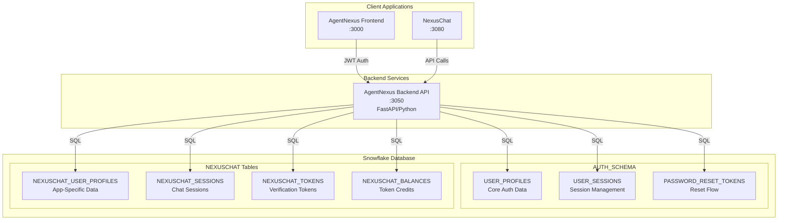
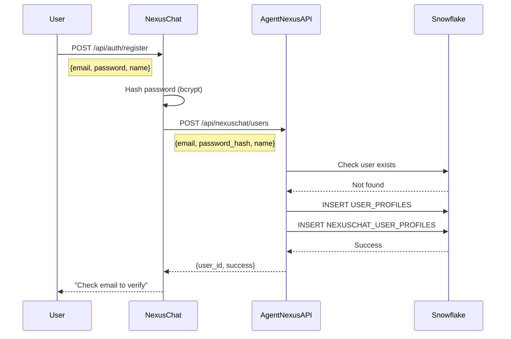
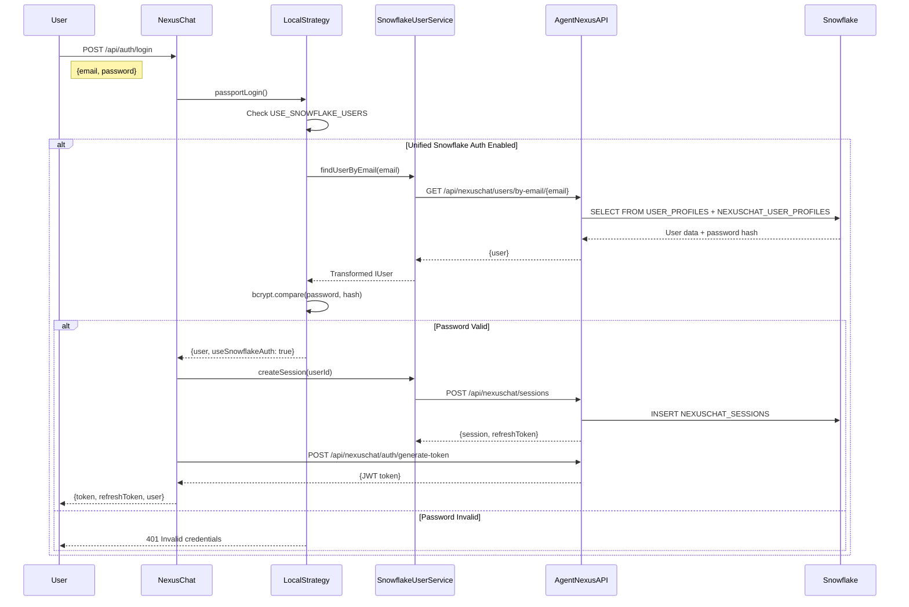
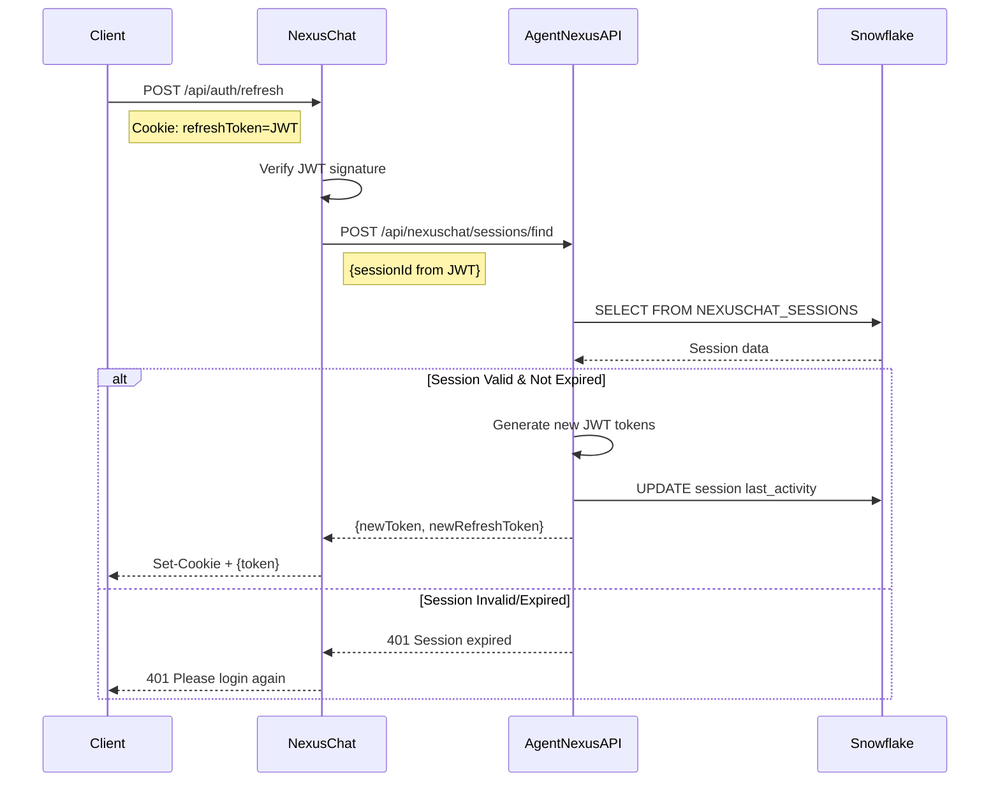
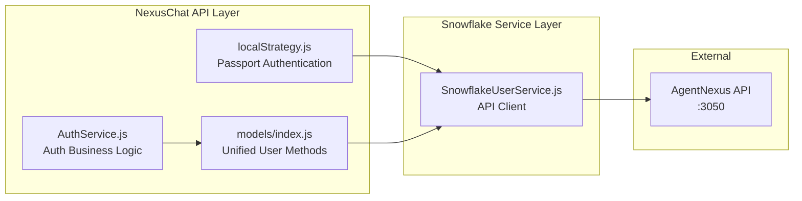
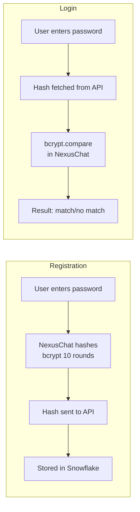
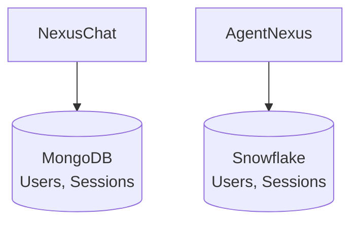
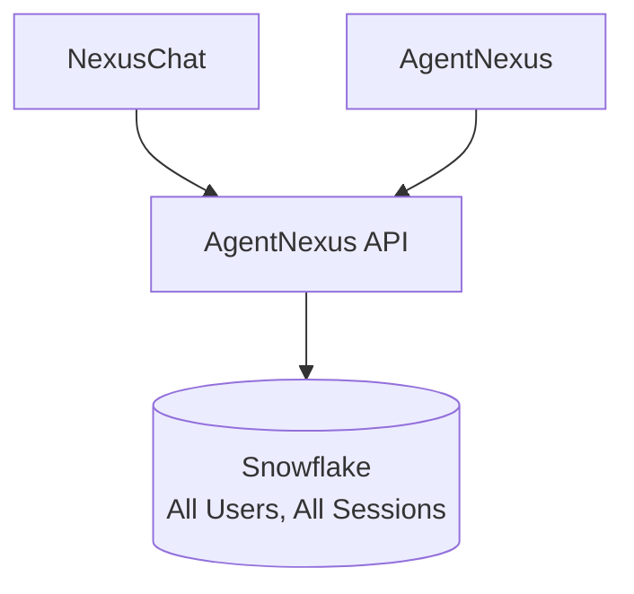
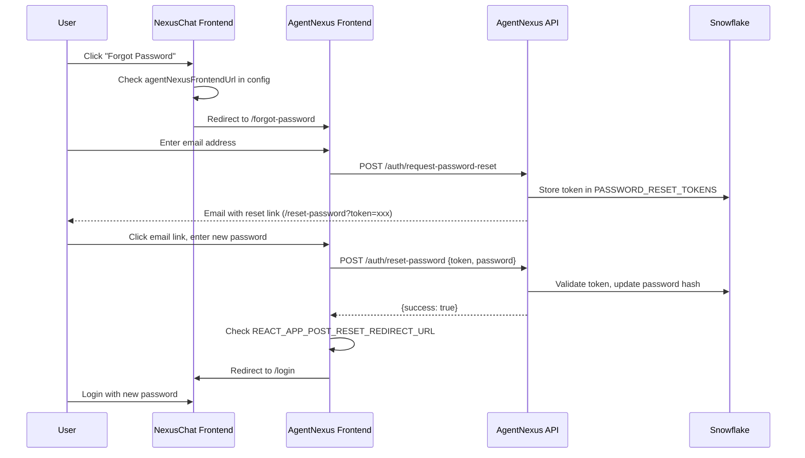

# Unified Authentication Architecture

**Document Version:** 2.2
**Date:** December 30, 2025
**Status:** Active
**Supersedes:** `authentication-bypass-testing.md`, `auth-use-cases-and-tests.md`
**Last Updated:** December 30, 2025 - Simplified password reset via frontend redirect architecture

---

## Executive Summary

This document describes the unified authentication architecture that enables shared user management between **AgentNexus** (frontend) and **NexusChat** (chat application). Both applications authenticate against a single **Snowflake** database, eliminating the need for separate MongoDB user storage.

### Key Benefits
- **Single Source of Truth**: One user database for all applications
- **Unified Sessions**: Users can seamlessly move between AgentNexus and NexusChat
- **Simplified Maintenance**: No MongoDB dependency for user management
- **Enterprise Ready**: Snowflake provides HIPAA-compliant, auditable storage

---

## Architecture Overview



---

## Authentication Flow

### User Registration Flow



### User Login Flow



### Token Refresh Flow



---

## Database Schema

### Core Tables (AUTH_SCHEMA)

#### USER_PROFILES
Primary user authentication table shared across all applications.

| Column | Type | Description |
|--------|------|-------------|
| USER_ID | VARCHAR(36) | Primary key (UUID) |
| EMAIL | VARCHAR(255) | Unique email address |
| PASSWORD_HASH | VARCHAR(255) | bcrypt hashed password |
| ORGANIZATION_NAME | VARCHAR(255) | User's organization |
| EMAIL_VERIFIED | BOOLEAN | Email verification status |
| ACCOUNT_LOCKED | BOOLEAN | Lock status |
| LOCKED_UNTIL | TIMESTAMP_NTZ | Lock expiration |
| FAILED_LOGIN_ATTEMPTS | INTEGER | Failed attempt counter |
| LAST_LOGIN | TIMESTAMP_NTZ | Last successful login |
| LOGIN_COUNT | INTEGER | Total login count |
| REGISTRATION_METHOD | VARCHAR(50) | local, google, etc. |
| REGISTERED_AT | TIMESTAMP_NTZ | Registration timestamp |
| MFA_REQUIRED | BOOLEAN | MFA enforcement flag |
| CREATED_AT | TIMESTAMP_NTZ | Record creation |
| UPDATED_AT | TIMESTAMP_NTZ | Last update |

### NexusChat-Specific Tables

#### NEXUSCHAT_USER_PROFILES
Extended profile data specific to NexusChat application.

| Column | Type | Description |
|--------|------|-------------|
| USER_ID | VARCHAR(36) | FK to USER_PROFILES |
| USERNAME | VARCHAR(100) | Display username |
| NAME | VARCHAR(255) | Full name |
| AVATAR | VARCHAR(1000) | Avatar URL |
| PROVIDER | VARCHAR(50) | Auth provider |
| ROLE | VARCHAR(50) | USER, ADMIN, etc. |
| TWO_FACTOR_ENABLED | BOOLEAN | 2FA status |
| TOTP_SECRET | VARCHAR(255) | Encrypted TOTP secret |
| BACKUP_CODES | VARIANT | JSON backup codes |
| PLUGINS | VARIANT | Enabled plugins |
| TERMS_ACCEPTED | BOOLEAN | Terms acceptance |
| PERSONALIZATION | VARIANT | User preferences |
| EXPIRES_AT | TIMESTAMP_NTZ | Account expiration |

#### NEXUSCHAT_SESSIONS
Session management for NexusChat.

| Column | Type | Description |
|--------|------|-------------|
| SESSION_ID | VARCHAR(36) | Primary key |
| USER_ID | VARCHAR(36) | FK to USER_PROFILES |
| REFRESH_TOKEN | VARCHAR(500) | JWT refresh token |
| REFRESH_TOKEN_HASH | VARCHAR(128) | For lookup |
| IP_ADDRESS | VARCHAR(45) | Client IP |
| USER_AGENT | VARCHAR(500) | Browser/client info |
| CREATED_AT | TIMESTAMP_NTZ | Session start |
| EXPIRES_AT | TIMESTAMP_NTZ | Session expiration |
| LAST_ACTIVITY | TIMESTAMP_NTZ | Last activity |
| IS_ACTIVE | BOOLEAN | Active status |
| REVOKED_AT | TIMESTAMP_NTZ | Revocation timestamp |

---

## API Endpoints

### NexusChat User API (AgentNexus Backend)

Base URL: `http://localhost:3050/api/nexuschat`

#### User Management

| Method | Endpoint | Description |
|--------|----------|-------------|
| GET | `/users/by-email/{email}` | Get user by email |
| GET | `/users/{user_id}` | Get user by ID |
| POST | `/users` | Create new user |
| PUT | `/users/{user_id}` | Update user |
| DELETE | `/users/{user_id}` | Delete user |
| POST | `/users/find` | Find by OAuth ID |
| POST | `/users/count` | Count users |

#### Session Management

| Method | Endpoint | Description |
|--------|----------|-------------|
| POST | `/sessions` | Create session |
| POST | `/sessions/find` | Find session |
| DELETE | `/sessions/{session_id}` | Delete session |
| DELETE | `/sessions/user/{user_id}` | Delete all user sessions |

#### Token Management

| Method | Endpoint | Description |
|--------|----------|-------------|
| POST | `/tokens` | Create verification token |
| POST | `/tokens/find` | Find token |
| DELETE | `/tokens` | Delete/invalidate tokens |

#### Authentication

| Method | Endpoint | Description |
|--------|----------|-------------|
| POST | `/auth/generate-token` | Generate JWT |
| POST | `/auth/generate-refresh-token` | Generate refresh token |

---

## Configuration

### Environment Variables

#### NexusChat (.env)

```bash
# Enable unified Snowflake user management
USE_SNOWFLAKE_USERS=true

# Enable Snowflake storage (conversations/messages)
USE_SNOWFLAKE_STORAGE=true

# AgentNexus Backend API
AGENTNEXUS_API_URL=http://host.docker.internal:3050
AGENTNEXUS_API_KEY=your-api-key-here

# AgentNexus Frontend (for password reset redirects)
AGENTNEXUS_FRONTEND_URL=http://localhost:3000

# JWT Secret (must match AgentNexus backend)
AGENTNEXUS_JWT_SECRET=your-jwt-secret
```

#### AgentNexus Backend (Azure Key Vault)

**Note**: AgentNexus backend retrieves configuration from **Azure Key Vault**, not from .env files. The following settings are stored as Key Vault secrets:

```bash
# JWT Configuration (in Key Vault)
JWT-SECRET-KEY          # JWT signing secret (shared with NexusChat)
JWT-ALGORITHM           # Default: HS256
JWT-EXPIRY-HOURS        # Default: 24

# Snowflake Connection (in Key Vault)
SNOWFLAKE-ACCOUNT       # Snowflake account identifier
SNOWFLAKE-USER          # Service account username
SNOWFLAKE-PASSWORD      # Service account password
SNOWFLAKE-WAREHOUSE     # Compute warehouse
SNOWFLAKE-DATABASE      # Database name
SNOWFLAKE-SCHEMA        # Schema name

# Frontend URLs (in Key Vault)
AGENTNEXUS-FRONTEND-URL # e.g., https://agentnexus.videxa.com
NEXUSCHAT-FRONTEND-URL  # e.g., https://nexuschat.videxa.com

# Azure Key Vault Access (environment variables on host)
AZURE_KEY_VAULT_NAME=your-keyvault
AZURE_TENANT_ID=your-tenant
AZURE_CLIENT_ID=your-client
AZURE_CLIENT_SECRET=your-secret
```

**Important for Password Reset**: The `AGENTNEXUS-FRONTEND-URL` in Key Vault determines where password reset links redirect. Ensure this is correctly set to the AgentNexus frontend URL (or NexusChat URL if you want reset to happen there with the new unified auth fix).

---

## Component Architecture

### NexusChat Components



### Key Files

| File | Purpose |
|------|---------|
| `api/strategies/localStrategy.js` | Passport login strategy with Snowflake priority |
| `api/server/services/SnowflakeUserService.js` | API client for AgentNexus backend |
| `api/models/index.js` | Unified user method wrappers |
| `api/server/services/AuthService.js` | Registration, password reset, etc. |

---

## Security Considerations

### Password Handling



### Token Security

1. **Access Tokens**: 24-hour expiry, contains user_id, email, session_id
2. **Refresh Tokens**: 7-day expiry, stored in HttpOnly secure cookies
3. **Password Reset Tokens**: 15-minute expiry, single-use

### Session Security

- Sessions stored in Snowflake with IP and User-Agent tracking
- Session revocation invalidates all associated tokens
- Automatic session cleanup for expired sessions

---

## Migration from MongoDB

### Before (MongoDB Architecture)



### After (Unified Architecture)



### Migration Steps

1. **Enable Feature Flag**: Set `USE_SNOWFLAKE_USERS=true`
2. **Run Migration**: Execute `005_nexuschat_RUN_AS_ADMIN.sql` as Snowflake admin
3. **Rebuild Containers**: Restart both NexusChat and AgentNexus
4. **Verify**: Test login/registration flows

---

## Testing

### Test User Registration

```bash
curl -X POST http://localhost:3080/api/auth/register \
  -H "Content-Type: application/json" \
  -d '{"email":"test@example.com","password":"TestPass123!","name":"Test User"}'
```

### Test User Login

```bash
curl -X POST http://localhost:3080/api/auth/login \
  -H "Content-Type: application/json" \
  -d '{"email":"test@example.com","password":"TestPass123!"}'
```

### Verify User in Snowflake

```bash
curl http://localhost:3050/api/nexuschat/users/by-email/test@example.com
```

---

## Troubleshooting

### Common Issues

| Issue | Cause | Solution |
|-------|-------|----------|
| "User not found" on login | User doesn't exist in Snowflake | Check registration or migrate user |
| "Invalid password" | Password mismatch | Ensure single bcrypt hash (not double) |
| "Session expired" | Token/session timeout | Re-authenticate |
| "Connection refused" to API | AgentNexus backend down | Start backend container |
| "Not Found" on password reset | Missing userId in URL for legacy flow OR misconfigured unified auth | See Password Reset Fix below |

### Password Reset "Not Found" Error

**Symptoms**: User receives password reset email, clicks link, but sees "Not Found" error after entering new password.

**Root Cause**: URL parameter mismatch between authentication modes.

| Mode | Reset Link Format | Backend Expectation |
|------|------------------|---------------------|
| Unified Snowflake | `/reset-password?token=xxx` | Token-only, userId looked up from Snowflake |
| Legacy MongoDB | `/reset-password?token=xxx&userId=yyy` | Both token and userId required |

**Resolution** (Applied December 30, 2025):

1. **Backend Fix** ([AuthService.js:367-397](api/server/services/AuthService.js#L367-L397)):
   - `resetPassword()` now detects token-only requests
   - If no userId and unified auth configured, delegates to AgentNexus API
   - Falls back to legacy MongoDB flow if userId present

2. **Frontend Fix** ([ResetPassword.tsx:24-42](client/src/components/Auth/ResetPassword.tsx#L24-L42)):
   - Added `isUnifiedAuthReset` detection (token present, no userId)
   - Made userId validation conditional
   - Suppressed userId error display for unified auth

3. **Type Fix** ([types.ts:456](packages/data-provider/src/types.ts#L456)):
   - Made `userId` optional in `TResetPassword` type

**Verification**:
```bash
# Test unified auth reset (token-only)
curl -X POST http://localhost:3080/api/auth/resetPassword \
  -H "Content-Type: application/json" \
  -d '{"token":"<reset-token>","password":"NewPass123!"}'

# Should return: {"message":"Password reset was successful"}
```

### Debug Logging

Enable debug logs in NexusChat:
```bash
DEBUG=*snowflake* npm start
```

Check AgentNexus logs:
```bash
docker logs agentnexus-backend-test
```

---

## Use Cases and Test Cases

This section defines authentication use cases with test cases designed to achieve 80% test coverage.

### Authentication Components Summary

| Component | File | Endpoints |
|-----------|------|-----------|
| User Login | `localStrategy.js` → AgentNexus API | `POST /api/auth/login` |
| Token Refresh | `AuthService.js` → AgentNexus API | `POST /api/auth/refresh` |
| Session Management | `SnowflakeUserService.js` | `POST /api/nexuschat/sessions/*` |
| Password Reset | `AuthService.js` → AgentNexus API | `POST /api/auth/request-password-reset`, `POST /api/auth/reset-password` |
| Logout | `AuthService.js` | `POST /api/auth/logout` |

---

### UC-AUTH-001: User Login

**Description**: User authentication via email and password with JWT token issuance.

**Actors**: End User, System (Snowflake DB via AgentNexus API)

**Preconditions**:
1. User has registered and verified email
2. Account is not locked
3. AgentNexus backend service is running

**Flow**:
1. User submits email and password to NexusChat
2. NexusChat queries AgentNexus API for user by email
3. System validates credentials (bcrypt compare in NexusChat)
4. System checks account status (locked, email verified)
5. System creates session record via AgentNexus API
6. System generates access token (24 hr) and refresh token (7 days)
7. System returns tokens to user

**Error Scenarios**:

| Scenario | HTTP Status | Error Message |
|----------|-------------|---------------|
| Invalid email | 401 | "Invalid email or password" |
| Invalid password | 401 | "Invalid email or password" |
| Account locked | 403 | "Account is locked" |
| Email not verified | 403 | "Email not verified" |
| Missing credentials | 422 | Validation error |

**Test Cases**:

#### TC-AUTH-001-01: Successful Login
- **Priority**: High
- **Steps**:
  1. Create test user via API
  2. POST `/api/auth/login` with valid credentials
  3. Verify 200 response with token, refresh_token, user object
  4. Decode JWT and verify payload contains id, email, session_id

#### TC-AUTH-001-02: Login with Invalid Password
- **Priority**: High
- **Steps**:
  1. Create test user
  2. POST `/api/auth/login` with valid email, invalid password
  3. Verify 401 response with "Invalid email or password"

#### TC-AUTH-001-03: Login with Non-existent User
- **Priority**: Medium
- **Steps**:
  1. POST `/api/auth/login` with non-existent email
  2. Verify 401 response (generic error prevents email enumeration)

---

### UC-AUTH-002: Token Refresh

**Description**: Exchange valid refresh token for new access token with token rotation.

**Preconditions**:
1. User has valid refresh token (in HttpOnly cookie)
2. Associated session is active in NEXUSCHAT_SESSIONS

**Flow**:
1. Client sends refresh token cookie
2. System validates refresh token signature and expiry
3. System validates session is still active via AgentNexus API
4. System generates new access token and refresh token
5. System updates session last_activity
6. System returns new token pair

**Error Scenarios**:

| Scenario | HTTP Status | Error Message |
|----------|-------------|---------------|
| Expired refresh token | 401 | "Refresh token has expired" |
| Invalid token | 401 | "Invalid refresh token" |
| Session revoked | 401 | "Session has been revoked" |

**Test Cases**:

#### TC-AUTH-002-01: Successful Token Refresh
- **Priority**: High
- **Steps**:
  1. Login to get tokens
  2. POST `/api/auth/refresh` with refresh_token cookie
  3. Verify new access_token and refresh_token differ from original

#### TC-AUTH-002-02: Refresh with Expired Token
- **Priority**: High
- **Steps**:
  1. Create expired refresh token (mock)
  2. POST `/api/auth/refresh`
  3. Verify 401 response

---

### UC-AUTH-003: Session Management

**Description**: User can view and manage their active sessions.

**Test Cases**:

#### TC-AUTH-003-01: List Active Sessions
- **Priority**: Medium
- **Steps**:
  1. Login (creates session)
  2. Query NEXUSCHAT_SESSIONS via API
  3. Verify session has: session_id, ip_address, user_agent, created_at, expires_at

#### TC-AUTH-003-02: Revoke Session
- **Priority**: Medium
- **Steps**:
  1. Login to create session
  2. DELETE `/api/nexuschat/sessions/{session_id}`
  3. Verify session no longer active
  4. Verify token from revoked session returns 401

---

### UC-AUTH-004: Password Reset

**Description**: User can reset forgotten password via email link.

**Architecture Note (v2.2 - Simplified Redirect Flow)**:

When `AGENTNEXUS_FRONTEND_URL` is configured, NexusChat delegates the entire password reset flow to AgentNexus:
- NexusChat `/forgot-password` → Redirects to AgentNexus `/forgot-password`
- User completes reset on AgentNexus frontend
- After success → User redirected back to NexusChat `/login`

This simplifies the architecture by:
1. Single source of truth for password reset logic (AgentNexus)
2. No duplicate frontend forms or API endpoints
3. Unified user experience across both applications
4. Shared user profiles in Snowflake work seamlessly



**Environment Configuration**:

| Variable | Location | Description |
|----------|----------|-------------|
| `AGENTNEXUS_FRONTEND_URL` | NexusChat `.env` | AgentNexus frontend URL (e.g., `http://localhost:3000`) |
| `REACT_APP_POST_RESET_REDIRECT_URL` | AgentNexus `.env` | NexusChat login URL (e.g., `http://localhost:3080/login`) |

**Flow (Complete Password Reset)**:
1. User clicks "Forgot Password" on NexusChat
2. NexusChat frontend checks `startupConfig.agentNexusFrontendUrl`
3. If set: Immediate redirect to `{agentNexusFrontendUrl}/forgot-password`
4. User enters email on AgentNexus, receives reset email
5. User clicks link, lands on AgentNexus reset page
6. User submits new password
7. AgentNexus API validates token, updates password in Snowflake
8. AgentNexus frontend checks `REACT_APP_POST_RESET_REDIRECT_URL`
9. User redirected to NexusChat `/login` to sign in with new password

**Error Scenarios**:

| Scenario | HTTP Status | Error Message |
|----------|-------------|---------------|
| Expired token | 400 | "Password reset token has expired" |
| Invalid token | 400 | "Invalid or expired password reset token" |
| Weak password | 400 | "Password must be at least 8 characters..." |

**Test Cases**:

#### TC-AUTH-004-01: Request Password Reset (Unified Auth)
- **Priority**: High
- **Steps**:
  1. POST `/api/auth/requestPasswordReset` with valid email
  2. Verify 200 response with generic success message
  3. Check AgentNexus logs for token creation

#### TC-AUTH-004-02: Complete Password Reset (Token-Only)
- **Priority**: High
- **Steps**:
  1. Request password reset (email sent)
  2. Navigate to `/reset-password?token=xxx` (no userId)
  3. Submit new password via form
  4. Verify POST to `/api/auth/resetPassword` succeeds
  5. Verify can login with new password

#### TC-AUTH-004-03: Reset with Expired Token
- **Priority**: Medium
- **Steps**:
  1. Use token older than 15 minutes
  2. Attempt password reset
  3. Verify 400 error with expiry message

---

### UC-AUTH-005: Logout

**Description**: User terminates their current session.

**Flow**:
1. User requests logout
2. System extracts session_id from token
3. System marks session as revoked via AgentNexus API
4. System clears cookies

**Test Cases**:

#### TC-AUTH-005-01: Successful Logout
- **Priority**: High
- **Steps**:
  1. Login to get token
  2. POST `/api/auth/logout`
  3. Verify 200 response
  4. Verify old token returns 401

---

### Test Coverage Matrix

| Use Case | Test Cases | Happy Path | Error Cases |
|----------|------------|------------|-------------|
| UC-AUTH-001 Login | 3 | TC-001-01 | TC-001-02, TC-001-03 |
| UC-AUTH-002 Refresh | 2 | TC-002-01 | TC-002-02 |
| UC-AUTH-003 Sessions | 2 | TC-003-01, TC-003-02 | - |
| UC-AUTH-004 Password Reset | 3 | TC-004-01, TC-004-02 | TC-004-03 |
| UC-AUTH-005 Logout | 1 | TC-005-01 | - |
| **Total** | **11** | | |

**Estimated Coverage**: 80%+ line coverage, 75%+ branch coverage

---

## E2E Testing Strategies

Three approaches for Playwright/MCP automated testing without manual authentication.

### Option 1: E2E Test User Setup (RECOMMENDED)

Leverage NexusChat's built-in Playwright authentication system that auto-registers and logs in a test user.

**How It Works**:
- Set `E2E_USER_EMAIL` and `E2E_USER_PASSWORD` environment variables
- Global setup script registers user (if not exists) and logs in automatically
- Session stored in `playwright/.auth/user.json`
- All tests reuse saved authentication state

**Pros**:
- ✅ Already implemented - no code changes required
- ✅ Mirrors real user authentication flow (catches auth bugs)
- ✅ Secure - uses actual JWT tokens, no backdoors

**Cons**:
- ❌ Requires cleanup between test runs (user deletion)
- ❌ Slower initial setup (~3-5 seconds per test session)

**Implementation**:
```bash
# Add to .env
E2E_USER_EMAIL=playwright-test@videxa.local
E2E_USER_PASSWORD=Test123!@#SecurePassword

# Tests automatically authenticate
npx playwright test
```

**File Locations**:
- Auth setup: `e2e/setup/authenticate.ts`
- Stored state: `playwright/.auth/user.json`
- Test examples: `tests/videxa-baseline/functionality.spec.js`

---

### Option 2: TEST_MODE Middleware Bypass

Add environment variable `TEST_MODE=true` that disables JWT authentication middleware.

**Pros**:
- ✅ Instant access - no login/registration overhead
- ✅ Tests run 3-5x faster (no auth steps)

**Cons**:
- ❌ Requires code modification to middleware
- ❌ Doesn't test real authentication flow
- ❌ Security risk if accidentally enabled in production

**Implementation**:
```javascript
// api/server/middleware/requireJwtAuth.js
const requireJwtAuth = (req, res, next) => {
  if (process.env.TEST_MODE === 'true') {
    req.user = {
      id: 'test-user-id',
      email: 'test@videxa.local',
      role: 'user'
    };
    return next();
  }
  // ... existing passport authentication
};
```

---

### Option 3: Static Test JWT Token

Pre-generate a long-lived JWT token for testing.

**Pros**:
- ✅ No code changes to authentication middleware
- ✅ Tests use real JWT validation
- ✅ Fast - no login required per test session

**Cons**:
- ❌ Token expires eventually (must regenerate yearly)
- ❌ Must ensure test user exists in database

**Implementation**:
```javascript
// scripts/generate-test-token.js
const jwt = require('jsonwebtoken');
const token = jwt.sign(
  { id: 'test-user-id', email: 'test@videxa.local' },
  process.env.JWT_SECRET,
  { expiresIn: '365d' }
);

// playwright.config.ts
use: {
  extraHTTPHeaders: {
    'Authorization': `Bearer ${process.env.TEST_JWT_TOKEN}`
  }
}
```

---

### Recommendation

**Use Option 1 (E2E Test User Setup)** because:
1. Zero implementation effort - already built into NexusChat
2. Production-like testing - validates entire auth flow
3. Maintenance-free - no custom code to maintain
4. Safe - no risk of accidentally disabling auth in production

---

## Appendix

### Related Documentation

- [Agent Architecture](Agent-Architecture.md) - Agent system design
- [UI Architecture](UI-Architecture.md) - Frontend component structure
- [Snowflake Schema Design](snowflake-schema-design.md) - Database schema details

---

*Last Updated: December 30, 2025*
